# WSL Manager

> Application Windows portable pour gérer visuellement vos instances WSL2.

---

## Présentation

WSL Manager est une application de bureau Windows (portable, sans installation) qui offre une interface graphique complète pour administrer vos distributions WSL2. Fini les commandes `wsl` en ligne de commande : toutes les opérations courantes sont accessibles en quelques clics.

L'application s'intègre dans la barre système et reste disponible en arrière-plan pour surveiller vos instances.

---

## Captures d'écran

### Tableau de bord

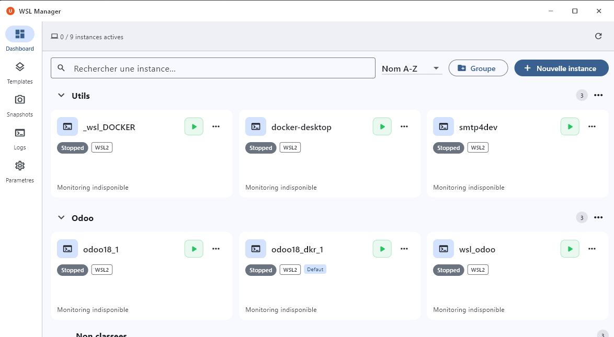

### Détail d'une instance

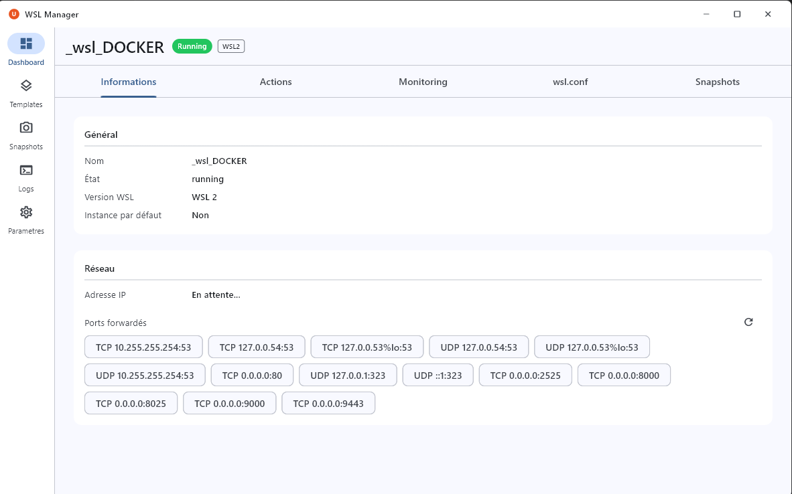

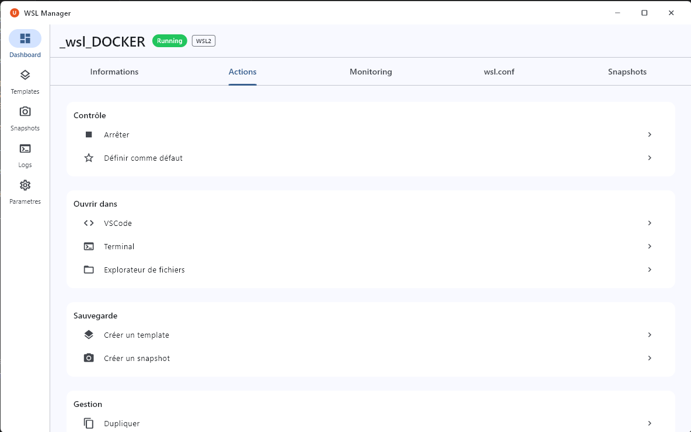

### Monitoring

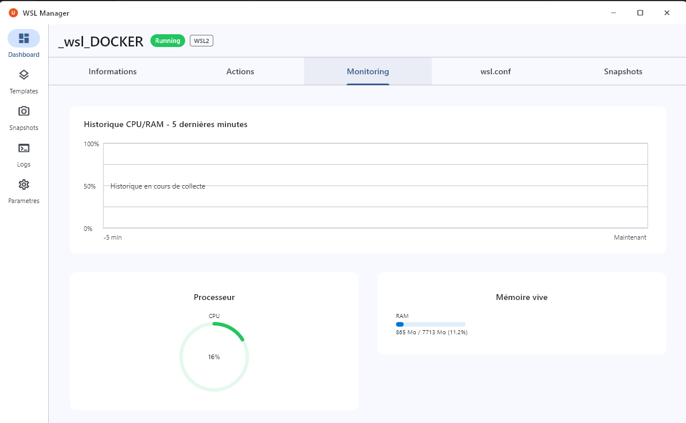

### Configuration WSL

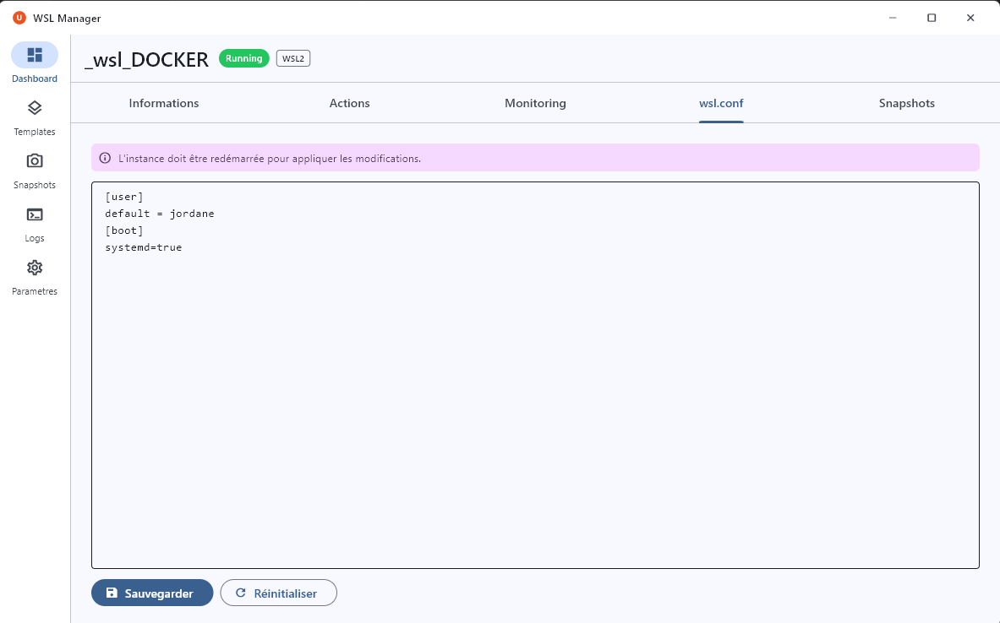

### Assistant de création

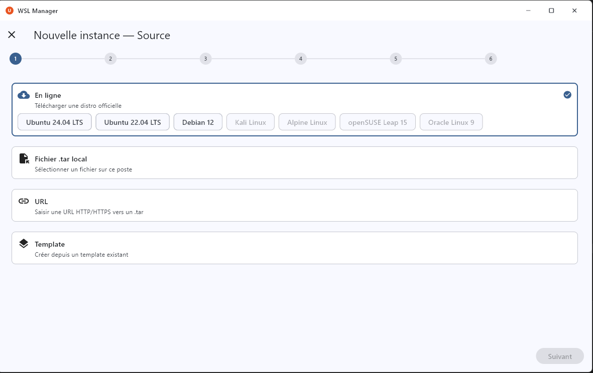

### Gestion des templates

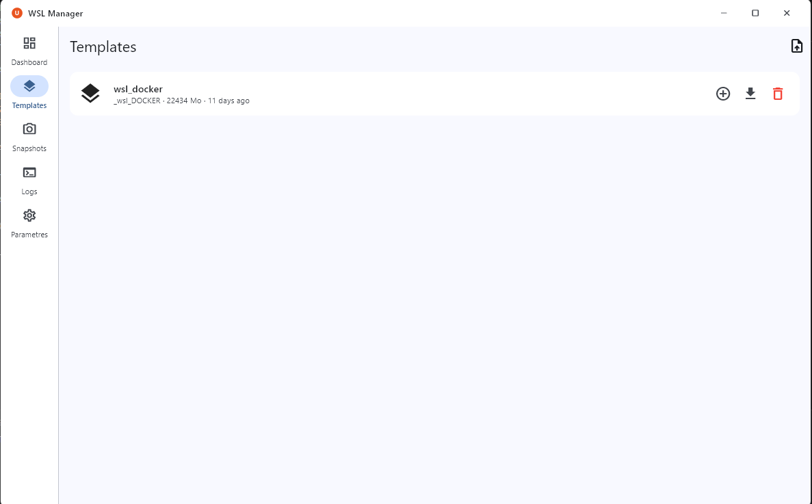

### Journal des commandes

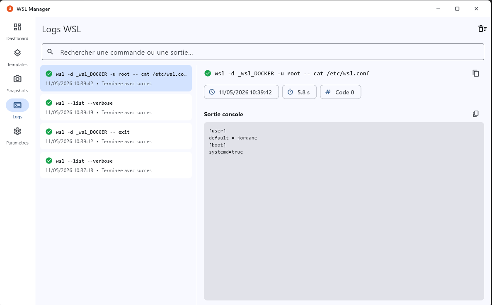

### Paramètres

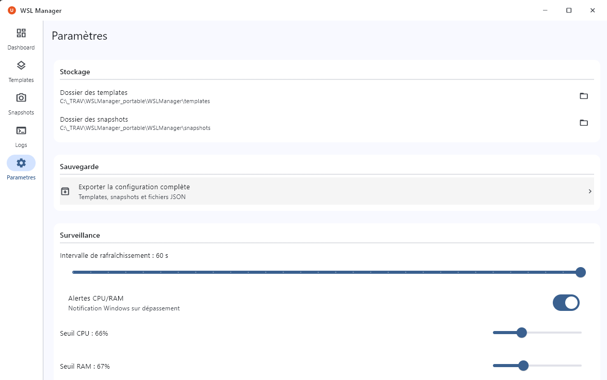

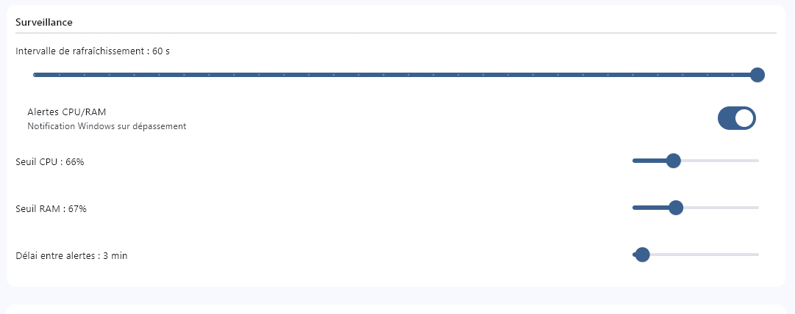

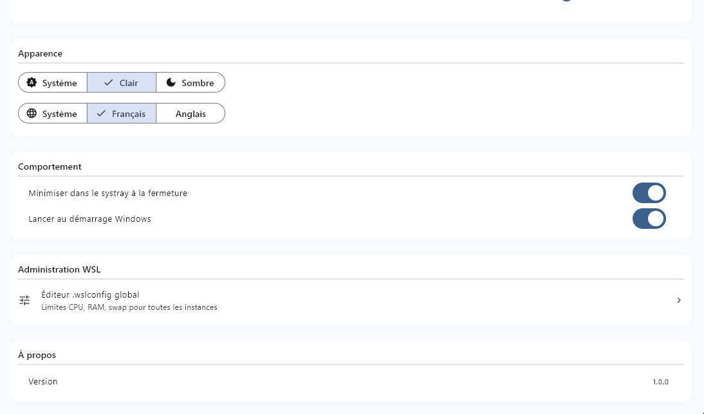

---

## Fonctionnalités

### Gestion des instances
- **Démarrer / Arrêter** une instance en un clic
- **Créer** une nouvelle instance via un assistant pas-à-pas (nom, source, utilisateur, mot de passe, chemin d'installation)
- **Supprimer** une instance avec confirmation
- **Dupliquer** une instance existante
- **Renommer** une instance (automatiquement géré en arrière-plan)
- **Convertir** WSL1 ↔ WSL2 (avec élévation UAC à la demande)
- **Ouvrir un terminal** directement depuis l'interface (Windows Terminal ou CMD en fallback)

### Configuration WSL
- **Éditer le fichier `.wslconfig`** global directement depuis l'interface (limites CPU, RAM, swap, etc.)
- **Éditer la configuration** par instance

### Ports forwarding
- Visualiser les **ports redirigés** pour chaque instance
- Gérer les règles de forwarding depuis l'écran de détail

### Groupes
- Organiser les instances par **groupes personnalisés**
- Filtrage et affichage par groupe depuis le tableau de bord

### Snapshots
- **Créer** un snapshot (export `.tar`) d'une instance à tout moment
- **Restaurer** une instance depuis un snapshot
- **Gérer** la bibliothèque de snapshots (liste, suppression)

### Templates
- **Sauvegarder** une instance comme template réutilisable
- **Créer** rapidement une nouvelle instance depuis un template
- **Gérer** la bibliothèque de templates

### Monitoring
- Surveillance en temps réel du **CPU** et de la **RAM** par instance
- Barre de statistiques globales visible depuis le tableau de bord
- Graphiques de charge avec historique
- **Seuils d'alerte** configurables pour CPU et RAM

### Journal des commandes
- Historique de toutes les commandes `wsl` exécutées par l'application
- Affichage du statut (succès / erreur), de la durée et de la sortie de chaque commande
- Accessible via l'onglet **Logs** dans la barre de navigation

### Intégration système
- **Icône dans la barre système** (systray) avec menu contextuel
- Option de **minimisation vers le systray** à la fermeture de la fenêtre
- Effet visuel **Mica** (Windows 11)
- Interface **responsive** : s'adapte aux fenêtres de petite taille

---

## Prérequis

| Composant | Version minimale |
|---|---|
| Windows | 11 x64 |
| WSL2 | activé et configuré |
| Aucun runtime .NET / VC++ requis | — |

---

## Installation

1. Télécharger `WSLManager_portable.zip` depuis la [page des releases](https://github.com/jordane45/wslManager/releases)
2. Extraire le contenu dans le dossier de votre choix
3. Lancer `WSLManager.exe`

Aucune installation requise. Les données de l'application (templates, snapshots, configuration, journal) sont stockées dans `%LOCALAPPDATA%\WSLManager\`.

---

## Licence

© Jordane Reynet — [CC BY-NC-ND 4.0](https://creativecommons.org/licenses/by-nc-nd/4.0/)

Usage personnel et non commercial uniquement. Redistribution sans modification autorisée avec attribution.
